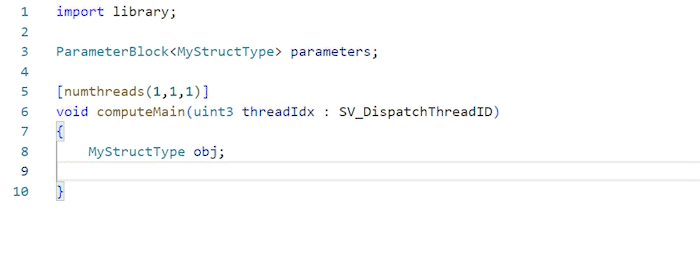
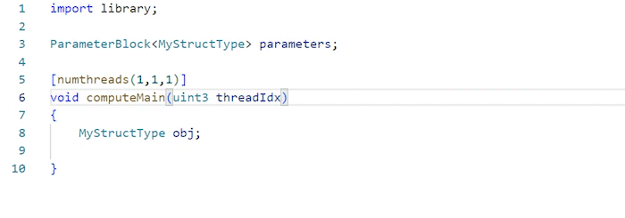

# Language extension for Slang shading language

This is the official Visual Studio Code extension for the Slang shading language. Powered by the Slang shader compiler, this extension provides accurate coding assist for both Slang and HLSL.

Both Slang and this extension are open source projects on GitHub. We welcome feedback and contributions. Please report issues or suggest improvements at https://github.com/shader-slang/slang-vscode-extension/issues

## Features

This extension provides the following assisting features:
- Enhanced semantic highlighting: user-defined types, variables, parameters and properties will be highlighted.
- Code completion: show suggestions of object/type members and HLSL semantics.
- Function signature help: view function signatures at call sites.
- Hover information: displays the signature and documentation for the symbol that your mouse is hovering over.
- Go to definition: jumps to the source location that defines the current symbol.
- Document symbol: displays the outline of symbols defined in current document.
- Diagnostics: displays current compilation errors.

## Configurations

### Predefined preprocessor macros

You can specifiy the set of predefined preprocessor macros that the language server will use via the `slang.predefinedMacros` setting. This will help the language server to provide more accurate result.

### Additional Search Path

By default, the extension will search for all sub directories in the current workspace for an included or imported file. You can specify additional search paths via the `slang.additionalSearchPaths` setting, which will be looked at first. You can also disable the search in workspace directories and make the extension to search only in configured search paths (via `slang.searchInAllWorkspaceDirectories`). The path of the currently opend file will always be used.

## Demo

Auto completion and signature help:  

HLSL Semantics suggestions:  

Goto definition:  

## For more information

* [Slang public repository](http://github.com/shader-slang/slang)
* [Slang Visual Studio Code Extension repository](https://github.com/shader-slang/slang-vscode-extension)

